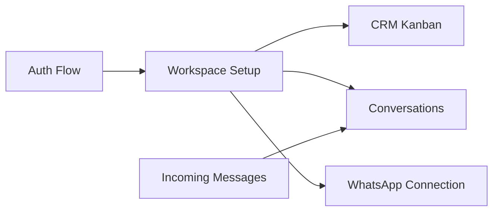
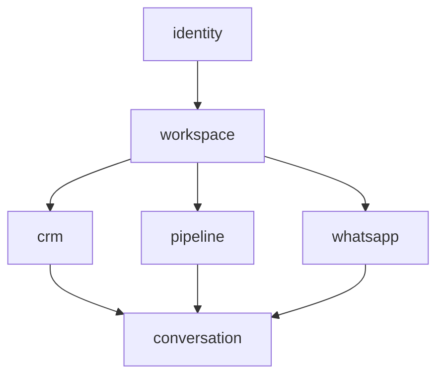

# Audit Arquitetural: Evolução para Modular Monolith

**Data:** Janeiro 2026  
**Versão:** 1.0  
**Status:** Fase 1 Implementada

---

## 1. Inventário do Sistema (Mapeamento Real)

### 1.1 Módulos/Áreas Existentes

| Área | Localização Atual | Responsabilidade |
|------|-------------------|------------------|
| **Auth/Identity** | `contexts/AuthContext.tsx`, `pages/Auth.tsx` | Login, signup, sessão |
| **Workspace/Tenancy** | `contexts/WorkspaceContext.tsx`, `modules/workspace/` | Multi-tenant, membros, convites |
| **CRM/Contacts** | `hooks/useContacts.ts`, `core/domain/entities/Contact.ts` | Gestão de contatos |
| **Pipelines/Kanban** | `hooks/usePipelines.ts`, `components/kanban/` | Pipelines, estágios, cards |
| **Conversations** | `hooks/useConversations.ts`, `hooks/useMessages.ts` | Conversas e mensagens |
| **WhatsApp Integration** | `hooks/useWhatsappNumbers.ts`, `supabase/functions/evolution-webhook/` | Integração WhatsApp |
| **Groups** | `hooks/useGroupClasses.ts`, `hooks/useGroupConversations.ts` | Gestão de grupos |

### 1.2 Fluxos Principais



### 1.3 Integrações Externas

| Integração | Tipo | Endpoint |
|------------|------|----------|
| Supabase Database | DB | PostgreSQL via RLS |
| Supabase Auth | Auth | Built-in |
| Supabase Storage | Storage | whatsapp-media bucket |
| Supabase Realtime | Pub/Sub | Channels |
| Evolution API | External API | WhatsApp Business |

---

## 2. Diagnóstico Arquitetural

### 2.1 Classificação Geral

| Categoria | Status | Score |
|-----------|--------|-------|
| Domain Layer | 🟡 AMARELO | 5/10 |
| Application Layer | 🔴 VERMELHO | 3/10 |
| Infrastructure Layer | 🟡 AMARELO | 6/10 |
| Presentation Layer | 🟡 AMARELO | 5/10 |
| Edge Functions | 🟢 VERDE | 8/10 |
| **MÉDIA GERAL** | **🟡 AMARELO** | **5.4/10** |

### 2.2 Problemas Identificados

#### CRÍTICO
- Hooks acessando Supabase diretamente (`usePipelines` - 415 linhas)
- Business logic em hooks de UI (`useConversationStages`)
- Tipos duplicados em `types/database.ts` vs entidades

#### MÉDIO
- `KanbanView` coordenando 5+ hooks (god component)
- `MessageThread` com 411 linhas
- Falta de entidades para Card, WhatsAppNumber
- Toast chamado dentro de hooks

#### BAIXO
- `LegacyContact` e `_domain` pattern
- Arquivos não utilizados
- Imports de `Tables` em componentes

---

## 3. Boundaries: Modular Monolith

### 3.1 Estrutura de Módulos



### 3.2 Detalhamento por Módulo

| Módulo | Responsabilidade | Entidades | Dependências |
|--------|------------------|-----------|--------------|
| `identity` | Auth, Users, Profiles | User, Profile | Nenhuma |
| `workspace` | Multi-tenancy, Membros | Workspace, WorkspaceMember | identity |
| `crm` | Contacts, Classes, Tags | Contact, ContactClass | workspace |
| `pipeline` | Pipelines, Stages, Cards | Pipeline, Stage, Card | workspace, crm |
| `conversation` | Conversas, Messages | Conversation, Message | workspace, crm, pipeline, whatsapp |
| `whatsapp` | Conexão WhatsApp | WhatsAppNumber | workspace |

---

## 4. Estrutura de Pastas Alvo

```
/src
  /modules
    /workspace ✅ IMPLEMENTADO
      /domain
        /entities
          Workspace.ts ✅
          WorkspaceMember.ts ✅
        /ports
          WorkspaceRepository.ts ✅
      /infrastructure
        /mappers
          WorkspaceMapper.ts ✅
        /repositories
          SupabaseWorkspaceRepository.ts ✅
      /presentation
        /hooks
          useUserWorkspaces.ts ✅
        /components
          WorkspaceSelector.tsx ✅
      index.ts ✅
    
    /identity (a implementar)
    /crm (a implementar)
    /pipeline (a implementar)
    /conversation (a implementar)
    /whatsapp (a implementar)
    
  /shared
    /kernel
      /types
        Result.ts
        Entity.ts
      /utils
        date-utils.ts
    /ui
      /components (shadcn)
      types.ts
      
  /app
    /providers
    /routes
```

---

## 5. Regras de Arquitetura

### 5.1 Regras de Importação

```typescript
// ✅ PERMITIDO
import { Workspace } from '@/modules/workspace';
import { cn } from '@/lib/utils';
import { Button } from '@/components/ui/button';

// ❌ PROIBIDO
import { WorkspaceMapper } from '@/modules/workspace/infrastructure/mappers/WorkspaceMapper';
import { supabase } from '@/integrations/supabase/client'; // em hooks de UI
```

### 5.2 Regras por Camada

| Camada | Pode Importar | Não Pode Importar |
|--------|---------------|-------------------|
| `domain/` | shared/kernel | infrastructure/, presentation/, React |
| `application/` | domain/, shared/kernel | infrastructure/, presentation/ |
| `infrastructure/` | domain/, application/, supabase | presentation/ |
| `presentation/` | Todas as camadas | Supabase direto |

---

## 6. Progresso da Implementação

### Fase 1: Estrutura Base ✅ COMPLETO

- [x] Criar `/src/modules/workspace/`
- [x] Criar entidades `Workspace`, `WorkspaceMember`
- [x] Criar `WorkspaceRepository` port
- [x] Criar `WorkspaceMapper`
- [x] Criar `SupabaseWorkspaceRepository`
- [x] Criar hook `useUserWorkspaces`
- [x] Refatorar `WorkspaceContext` para multi-workspace
- [x] Criar `WorkspaceSelector` component
- [x] Integrar seletor no `PipelineHeader`

### Fase 2: Identity + Workspace (Pendente)

- [ ] Extrair `AuthContext` para `modules/identity/`
- [ ] Criar `AuthService` com use cases
- [ ] Migrar `useWorkspaceMembers` para usar repository

### Fase 3: CRM + Pipeline (Pendente)

- [ ] Mover entidades para `modules/crm/`
- [ ] Refatorar `usePipelines` (split em services)
- [ ] Criar `Card` entity

### Fase 4: Conversation + WhatsApp (Pendente)

- [ ] Mover entidades para `modules/conversation/`
- [ ] Criar `WhatsAppNumber` entity
- [ ] Abstrair Realtime subscriptions

---

## 7. Benefícios da Arquitetura

1. **Multi-workspace funcional** - Usuários podem pertencer a múltiplos workspaces
2. **Entidades de domínio** - Regras de permissão encapsuladas
3. **Separação clara** - Listagem e seleção de workspace separados
4. **Testabilidade** - Repositories podem ser mockados
5. **UX intuitiva** - Seletor só aparece quando necessário
6. **Persistência** - Escolha do usuário salva em localStorage

---

## 8. Princípios SOLID Aplicados

| Princípio | Aplicação |
|-----------|-----------|
| **SRP** | Cada entidade encapsula sua responsabilidade |
| **OCP** | Adicionar roles não requer modificar métodos |
| **LSP** | Repository pode ser substituído por mock |
| **ISP** | Hook `useUserWorkspaces` faz apenas listagem |
| **DIP** | Context depende de abstração Repository |

---

## Próximos Passos

1. Implementar módulo `identity`
2. Migrar `useContactClasses` para `modules/crm`
3. Split `usePipelines` em services menores
4. Adicionar testes unitários para entidades
5. Configurar eslint-plugin-boundaries
