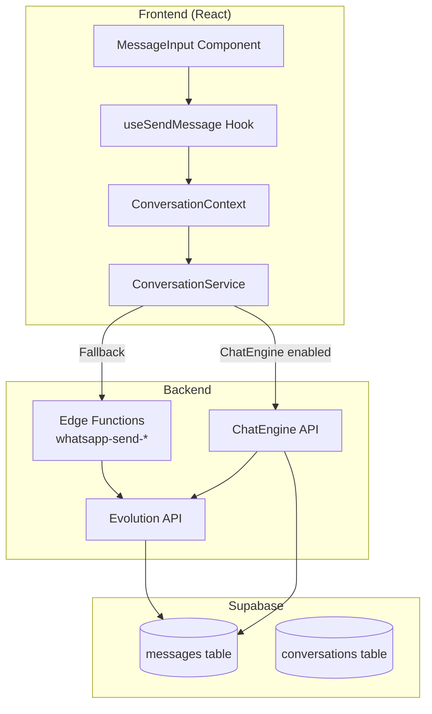
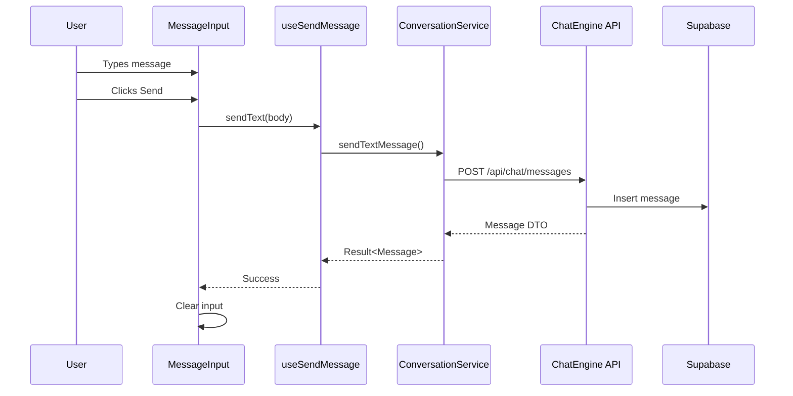
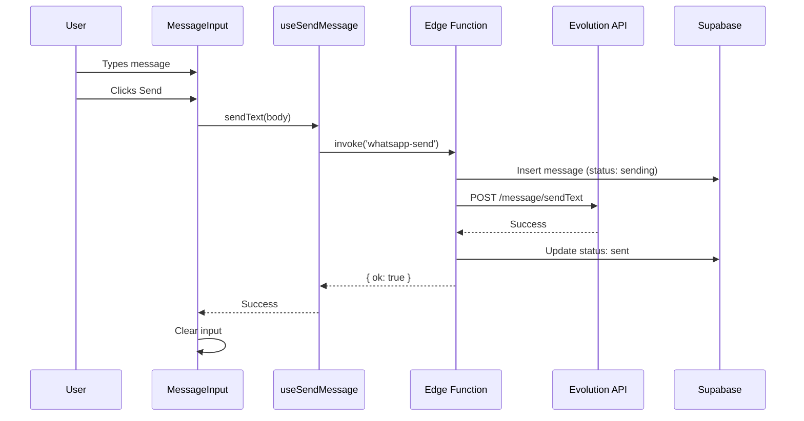
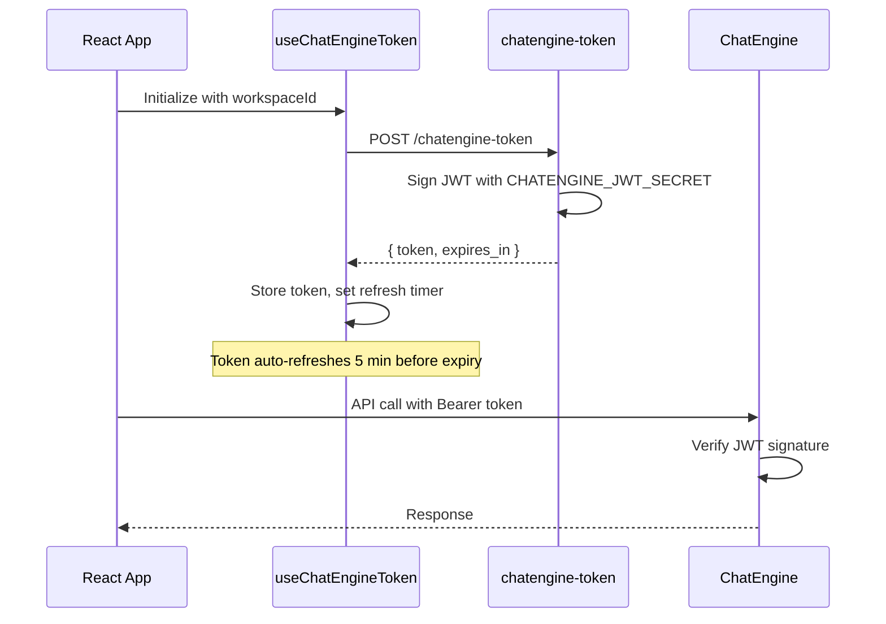

# ChatEngine Integration

## Overview

This document describes the integration between the Lovable CRM project and ChatEngine, a unified messaging backend that abstracts multiple providers (WhatsApp, Instagram, etc.).

## Architecture



## Message Flow

### With ChatEngine Enabled



### Without ChatEngine (Fallback)



## Configuration

### Environment Variables

| Variable | Location | Description |
|----------|----------|-------------|
| `VITE_CHATENGINE_API_URL` | Frontend .env | ChatEngine API base URL |
| `CHATENGINE_JWT_SECRET` | Supabase Secrets | JWT signing secret for tokens |

### Enabling ChatEngine

1. Add the environment variable `VITE_CHATENGINE_API_URL` pointing to your ChatEngine instance
2. Add `CHATENGINE_JWT_SECRET` to Supabase Edge Function secrets
3. The system automatically detects configuration and routes messages accordingly

## Components

### ConversationService

Application layer service that orchestrates all conversation operations.

```typescript
// src/modules/conversation/application/services/ConversationService.ts

class ConversationService {
  // Uses ChatEngine when configured, otherwise throws
  async sendTextMessage(conversationId, body, replyToId?): Promise<Result<Message>>
  async sendImageMessage(conversationId, imageBase64, mimeType, caption?): Promise<Result<Message>>
  async sendAudioMessage(conversationId, audioBase64, mimeType): Promise<Result<Message>>
}
```

### useSendMessage Hook

Presentation layer hook that handles fallback logic.

```typescript
// src/modules/conversation/presentation/hooks/useSendMessage.ts

function useSendMessage(conversationId: string) {
  return {
    sendText: (body, replyToId?) => Promise<boolean>,
    sendImage: (imageBase64, mimeType, caption?) => Promise<boolean>,
    sendAudio: (audioBase64, mimeType) => Promise<boolean>,
    sending: boolean,
    isChatEngineEnabled: boolean,
  };
}
```

### ConversationContext

React context that provides the ConversationService instance.

```typescript
// src/modules/conversation/presentation/contexts/ConversationContext.tsx

function useConversation() {
  return {
    service: ConversationService,
    workspaceId: string | null,
    isChatEngineEnabled: boolean,
    isTokenLoading: boolean,
  };
}
```

## JWT Token Flow



## Edge Functions (Fallback)

When ChatEngine is not configured, the system falls back to these edge functions:

| Function | Purpose | Evolution API Endpoint |
|----------|---------|----------------------|
| `whatsapp-send` | Send text messages | `/message/sendText/{instance}` |
| `whatsapp-send-image` | Send image messages | `/message/sendMedia/{instance}` |
| `whatsapp-send-audio` | Send audio messages | `/message/sendWhatsAppAudio/{instance}` |

## File Structure

```
src/modules/conversation/
├── domain/
│   ├── entities/
│   │   ├── Conversation.ts
│   │   └── Message.ts
│   ├── ports/
│   │   ├── ConversationRepository.ts
│   │   └── MessageRepository.ts
│   └── value-objects/
│       ├── MessageStatus.ts
│       └── MessageType.ts
├── application/
│   └── services/
│       └── ConversationService.ts
├── infrastructure/
│   ├── chatengine/
│   │   ├── ChatEngineClient.ts
│   │   ├── ChatEngineMapper.ts
│   │   └── config.ts
│   └── supabase/
│       ├── SupabaseConversationRepository.ts
│       └── SupabaseMessageRepository.ts
└── presentation/
    ├── contexts/
    │   └── ConversationContext.tsx
    └── hooks/
        ├── useChatEngineToken.ts
        ├── useConversations.ts
        ├── useMessages.ts
        └── useSendMessage.ts
```

## Troubleshooting

### Messages not sending

1. Check if `VITE_CHATENGINE_API_URL` is set correctly
2. Verify `CHATENGINE_JWT_SECRET` is configured in Supabase secrets
3. Check edge function logs for errors
4. Verify the user is authenticated

### Token refresh issues

1. Check browser console for token fetch errors
2. Verify the `chatengine-token` edge function is deployed
3. Check if the JWT secret matches between edge function and ChatEngine

### Fallback not working

1. Ensure edge functions are deployed
2. Check `EVOLUTION_API_KEY` and `EVOLUTION_API_URL` secrets
3. Verify WhatsApp number is connected and active
